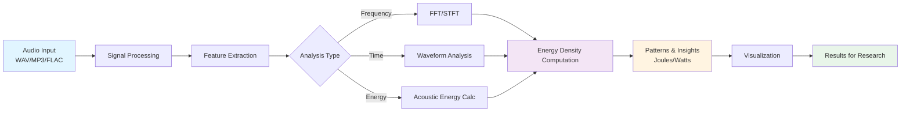

# Symphonic-Joules

**A tool for seeing patterns in sound that would otherwise remain invisible — across language, animal communication, and human expression. The physics is the lens, coherence is the destination.**

---

## 🎵 The Human Question

What stories are hidden in the sounds around us? From the distinctive tones of Mandarin to the alarm calls of birds, from the emotional subtext in human speech to the acoustic signatures of whale songs—sound carries meaning that transcends the visible. Yet most of these patterns remain invisible without the right tools to perceive them. Symphonic-Joules exists for researchers, field scientists, linguists, neurodivergent minds drawn to pattern synthesis, and anyone curious about what sound can reveal. We're building tools that let you listen deeper.

---

## 🔬 The Science That Powers It

We see sound through the **acoustic energy density equation**, which describes how sound carries energy through space:

<div align="center">

### **w = p² / (2ρc²) + ρv² / 2**

**Where:**
- **w** = acoustic energy density (J/m³)
- **p** = sound pressure (Pa)
- **ρ** = medium density (kg/m³)
- **c** = speed of sound (m/s)
- **v** = particle velocity (m/s)

</div>

This equation reveals a fundamental truth: sound is **energy in motion**, distributed between pressure variations (potential energy) and particle movement (kinetic energy). It's how we quantify the invisible.

---

## 💡 Use Cases: Patterns That Matter

### Birdsong & Animal Communication
Analyze the acoustic signatures of bird species, detect alarm calls, and study communication patterns in wildlife. Different species have distinct spectral signatures—Symphonic-Joules helps you visualize and quantify them, revealing behavioral patterns over time and across environments.

### Tonal Language Analysis
In languages like Mandarin, Yoruba, and Thai, tone carries meaning. The same word can mean different things based on pitch contour. Use energy-based frequency analysis to distinguish between tones, study language acquisition, or analyze dialect variation across populations.

### Emotional & Social Subtext in Speech
Voice carries more than words. Stress, emotion, confidence, and social relationship dynamics are all encoded in prosody and vocal energy patterns. Researchers studying psychology, social dynamics, or clinical speech can uncover these patterns quantitatively.

### Acoustic Ecology & Environmental Monitoring
Soundscapes tell stories about ecosystems. Forest density, insect activity, water quality—all leave acoustic signatures. Use Symphonic-Joules to process field recordings, identify species presence, and detect environmental changes through sound.

### Music & Cultural Analysis
Examine energy distribution across musical genres, track how orchestral arrangements direct listener attention, or study how cultural musical traditions distribute acoustic energy differently. Bridge the gap between musicology and physics.

### Clinical & Accessibility Research
Speech-language pathologists, audiologists, and researchers studying neurodivergence can analyze vocal patterns to detect speech disorders, track therapeutic progress, or understand how autistic or ADHD individuals produce and perceive sound differently.

---

## 📋 Table of Contents

- [The Human Question](#-the-human-question)
- [The Science That Powers It](#-the-science-that-powers-it)
- [Use Cases](#-use-cases-patterns-that-matter)
- [Architecture & Data Flow](#-architecture--data-flow)
- [Interface-First Design](#-interface-first-design)
- [Features](#-features)
- [Quick Start](#-quick-start)
- [Testing Philosophy: Documentation-as-Code](#-testing-philosophy-documentation-as-code)
- [Project Structure](#-project-structure)
- [Roadmap](#-roadmap)
- [Contributing](#-contributing)
- [Documentation](#-documentation)
- [Community](#-community)
- [License](#-license)

---

## 🌊 Architecture & Data Flow



*This pipeline transforms raw audio into quantifiable acoustic patterns—the foundation for understanding what sound reveals.*

---

## 💻 Interface-First Design

Symphonic-Joules follows an **interface-first** philosophy, where API design drives implementation. Below is the intended API showcasing how users will interact with the framework:

### Core Interfaces

```python
from symphonic_joules import AudioSignal, EnergyCalculator

# Load and represent an audio signal
signal = AudioSignal.from_file("birdsong.wav")

# Access signal properties
print(f"Duration: {signal.duration}s")
print(f"Sample Rate: {signal.sample_rate}Hz")
print(f"Channels: {signal.channels}")

# Calculate acoustic energy density
calculator = EnergyCalculator(
    medium_density=1.225,  # kg/m³ (air at 20°C)
    sound_speed=343.0      # m/s (air at 20°C)
)

# Compute energy metrics
energy_density = calculator.compute_energy_density(signal)
total_energy = calculator.compute_total_energy(signal)
power = calculator.compute_average_power(signal)

print(f"Energy Density: {energy_density:.6f} J/m³")
print(f"Total Energy: {total_energy:.6f} J")
print(f"Average Power: {power:.6f} W")

# Advanced: Frequency-domain energy analysis
freq_energy = calculator.energy_spectrum(signal)
freq_energy.plot(title="Energy Distribution by Frequency")
```

### Design Principles

1. **Explicit over Implicit**: Clear parameter names and units
2. **Type Safety**: Strong typing with validation
3. **Scientific Accuracy**: All calculations reference physics literature
4. **Composability**: Modular components that work together seamlessly
5. **Performance**: Efficient algorithms optimized for real-time processing

*This API is aspirational and drives our development roadmap.*

---

## ✨ Features

### Current (Phase 1: Foundation)

- 🏗️ **Solid Infrastructure**: Professional project structure following Python best practices
- 🎯 **Interface-First Design**: API designed before implementation for clarity
- 🔬 **Scientific Rigor**: Physics-based calculations with proper unit handling
- 🧪 **Documentation-as-Code**: Meta-tests that validate documentation accuracy
- 📊 **Comprehensive Testing**: 800+ tests across workflows, validation, and infrastructure
- 🔄 **CI/CD Pipeline**: Automated testing and quality checks
- 📚 **Rich Documentation**: Detailed guides for users and contributors
- ⚡ **Performance Focused**: Designed for efficient large-file processing

### Coming Soon (Phase 2: Communication Analysis)

- 🎼 **Audio Processing**: WAV, MP3, FLAC file support with streaming
- 📈 **Frequency Analysis**: FFT, STFT for revealing spectral patterns across time
- ⚡ **Energy Calculations**: Quantify acoustic energy across frequencies and time
- 🔍 **Feature Extraction**: Spectral features, MFCCs, and communication-specific markers
- 🎤 **Comparative Analysis**: Compare acoustic signatures across samples, species, languages, or individuals
- 📊 **Pattern Detection**: Automated identification of acoustic patterns and anomalies

### Future (Phase 3: Visualization & Accessibility)

- 📊 **Data Visualization**: Interactive plots, spectrograms with energy density heatmaps
- 🌐 **Web Dashboard**: Real-time acoustic pattern monitoring
- 💻 **CLI Tool**: `joule` command-line interface for batch processing
- 📤 **Export Tools**: JSON, CSV, and PDF report generation for research

---

## 🚀 Quick Start

### Prerequisites

- **Python 3.8 or higher** (Python 3.11 recommended for macOS users)
- **pip** (Python package installer)
- **git** (version control)

### Installation

```bash
# 1. Clone the repository
git clone https://github.com/JaclynCodes/Symphonic-Joules-a67272a4.git
cd Symphonic-Joules-a67272a4

# 2. Create and activate a virtual environment (recommended)
python -m venv venv

# On Windows:
venv\Scripts\activate

# On Unix/macOS:
source venv/bin/activate

# 3. Install the package in development mode
pip install -e .

# 4. Install development dependencies (optional, for contributors)
pip install -e ".[dev]"
```

### Verify Installation

```bash
# Run the test suite to verify installation
python -m pytest tests/ -v

# Check package version (note: Python package uses underscores, not hyphens)
python -c "import symphonic_joules; print(symphonic_joules.__version__)"
```

For detailed installation instructions, troubleshooting, and platform-specific guidance, see **[docs/installation-setup.md](docs/installation-setup.md)**.

---

## 🧪 Testing Philosophy: Documentation-as-Code

Symphonic-Joules employs a unique **Documentation-as-Code** approach where tests validate not just code functionality, but also documentation accuracy. This ensures our documentation never drifts from reality.

### The Validation Loop

```
Code Implementation → Documentation → Automated Tests → Validation
         ↑                                                  ↓
         └──────────────── Feedback Loop ─────────────────┘
```

### How It Works

Our test suite includes **meta-tests** that validate documentation itself:

```python
# From tests/test_readme_validation.py
class TestREADMEStructure:
    """Validates README has required sections"""
    
    def test_has_human_question_section(self, readme_content):
        assert '## The Human Question' in readme_content
    
    def test_has_use_cases_section(self, readme_content):
        assert '## Use Cases' in readme_content
```

### Benefits

- ✅ **Always Current**: Documentation is validated on every CI run
- ✅ **Trustworthy**: Users can rely on examples and information
- ✅ **Living Documentation**: Tests enforce documentation standards
- ✅ **Regression Prevention**: Changes that break docs fail tests

For comprehensive test documentation, see **[tests/README.md](tests/README.md)**.

---

## 📁 Project Structure

```
Symphonic-Joules/
├── .github/              # GitHub workflows, issue templates, and CI/CD
│   ├── workflows/        # CI/CD workflow definitions
│   └── ISSUE_TEMPLATE/   # Issue templates
├── docs/                 # Comprehensive documentation
│   ├── getting-started.md          # Getting started guide
│   ├── installation-setup.md       # Detailed installation
│   ├── api-reference.md            # API documentation
│   ├── architecture.md             # System architecture
│   ├── use-cases/                  # Domain-specific guides
│   ├── faq.md                      # Frequently asked questions
│   └── examples/                   # Code examples and tutorials
├── src/                  # Source code
│   └── symphonic_joules/ # Main package
│       ├── __init__.py   # Package initialization
│       ├── audio.py      # Audio processing module
│       ├── energy.py     # Energy calculations module
│       └── utils.py      # Utility functions
├── tests/                # Test suite (pytest)
│   ├── workflows/        # Workflow tests
│   └── *.py              # Test modules
├── CHANGELOG.md          # Project changelog
├── CONTRIBUTING.md       # Contribution guidelines
├── LICENSE               # MIT License
├── README.md             # This file
├── pytest.ini            # Pytest configuration
├── requirements.txt      # Project dependencies
├── ruff.toml             # Ruff linter configuration
└── setup.py              # Package setup script
```

---

## 🎯 Roadmap

Our development follows a **three-phase approach**, centered on enabling human-centered acoustic pattern discovery:

### 🏗️ Phase 1: Foundation (v0.1.0 - Current)

**Goal**: Establish robust infrastructure and scientific foundations

- [x] Project structure and documentation framework
- [x] CI/CD pipeline with GitHub Actions
- [x] Comprehensive test infrastructure with pytest
- [x] Package setup and distribution
- [x] Documentation-as-Code testing methodology
- [x] Scientific manifesto and acoustic energy density model
- [x] Interface-first API design
- [ ] Core `AudioSignal` class implementation
- [ ] Core `EnergyCalculator` class implementation
- [ ] Unit validation framework for physics calculations

**Deliverable**: A solid foundation ready for acoustic pattern analysis

---

### 🔬 Phase 2: Communication Analysis (v0.2.0 - Planned)

**Goal**: Enable acoustic pattern analysis for communication research

- [ ] **Audio I/O Module**
  - WAV, MP3, FLAC file format support with streaming
  - Multi-channel audio handling
  - Long-form recording support for field recordings
  
- [ ] **Signal Processing for Pattern Discovery**
  - Fast Fourier Transform (FFT) for frequency decomposition
  - Short-Time Fourier Transform (STFT) for time-frequency patterns
  - Windowing functions optimized for acoustic analysis
  
- [ ] **Energy Analysis & Metrics**
  - Acoustic energy density computation across time and frequency
  - Spectral centroid, bandwidth, and energy rolloff
  - Energy distribution patterns (where is the "loudness" concentrated?)
  - Comparative metrics (energy signatures across samples)
  
- [ ] **Communication-Specific Feature Extraction**
  - Mel-frequency cepstral coefficients (MFCCs) for voice/speech analysis
  - Pitch extraction and contour analysis (for tonal languages, prosody)
  - Zero-crossing rates and temporal dynamics
  - Spectral stability measures for distinguishing species/individuals
  
- [ ] **Visualization & Pattern Exploration**
  - Spectrogram with energy density overlay
  - Comparative spectrograms (side-by-side analysis)
  - Energy distribution heatmaps over time
  - Interactive exploration of acoustic space

**Deliverable**: Tools for discovering acoustic patterns in communication

---

### 📊 Phase 3: Visualization & Accessibility (v0.3.0 - Planned)

**Goal**: Make acoustic pattern analysis accessible to diverse users

- [ ] **Advanced Visualization**
  - Web-based interactive dashboards
  - 3D acoustic energy surfaces
  - Real-time spectrogram streaming
  
- [ ] **CLI & Batch Tools**
  - `joule analyze <audio>` - Quick acoustic summary
  - `joule compare <file1> <file2>` - Comparative analysis
  - `joule batch-process <directory>` - Process field recordings
  
- [ ] **Export & Reporting**
  - Publication-ready figures
  - CSV/JSON data export for further analysis
  - PDF research reports with visualizations
  - API for integration with other research tools
  
- [ ] **Accessibility Features**
  - CLI-first interface for scriptable access
  - Headless mode for server deployments
  - Integration with Jupyter notebooks
  - Support for neurodivergent workflows (batch processing, pattern focus)

**Deliverable**: Accessible toolkit for acoustic pattern discovery

---

### 🚀 Phase 4: Beyond (v1.0.0+)

**Future Directions**:
- Machine learning for automated pattern classification
- Distributed processing for large soundscape datasets
- Collaborative research platform for sharing acoustic analyses
- Mobile app for field recording and real-time analysis
- Integration with biodiversity databases and linguistic resources

---

## 🤝 Contributing

We welcome contributions from many backgrounds:

### Who We're Looking For

- **Bioacousticians & Field Researchers**: Bring domain expertise in animal communication and field recording
- **Linguists & Speech Scientists**: Help us analyze tonal languages, speech variation, and phonetics
- **Software Developers**: Build features, optimize performance, expand capabilities
- **Data Scientists & ML Researchers**: Develop pattern detection and classification tools
- **Neurodivergent Minds & Unique Thinkers**: If you see patterns in sound the way others see colors, we want your perspective
- **Accessibility Advocates**: Help ensure tools work for diverse ways of learning and working
- **Researchers & PhD Students**: Use this in your work, contribute improvements, help validate approaches

### How to Contribute

1. **Fork the Repository** - Click the "Fork" button on GitHub
2. **Create a Branch** - `git checkout -b feature/your-feature-name`
3. **Make Changes** - Implement your feature or fix
4. **Write Tests** - Add tests for your changes
5. **Run Tests** - Ensure all tests pass with `pytest`
6. **Submit a Pull Request** - Provide a clear description of your changes

### Contribution Pathways

- 🐛 **Report Bugs**: [Create an Issue](https://github.com/JaclynCodes/Symphonic-Joules-a67272a4/issues/new)
- 💡 **Suggest Features**: [Feature Request](https://github.com/JaclynCodes/Symphonic-Joules-a67272a4/issues/new?labels=enhancement)
- 📚 **Improve Documentation**: Documentation PRs are always welcome!
- 🔬 **Share Use Cases**: Tell us how you're using (or want to use) Symphonic-Joules
- 📋 **Good First Issues**: [Beginner-Friendly Tasks](https://github.com/JaclynCodes/Symphonic-Joules-a67272a4/labels/good%20first%20issue)

### Guidelines

- Follow **PEP 8** style guide for Python code
- Write clear commit messages
- Add tests for new features
- Update documentation as needed
- Be respectful and collaborative
- All contributions are welcomed regardless of experience level

Read the full **[Contributing Guidelines](CONTRIBUTING.md)** for detailed information.

---

## 📚 Documentation

Comprehensive documentation is available in the **[docs/](docs/)** directory:

- **[Getting Started Guide](docs/getting-started.md)** - Installation and first steps
- **[Installation & Setup](docs/installation-setup.md)** - Detailed installation instructions
- **[API Reference](docs/api-reference.md)** - Complete API documentation
- **[Use Cases](docs/use-cases/)** - Domain-specific guides and examples
- **[Architecture](docs/architecture.md)** - System design and structure
- **[FAQ](docs/faq.md)** - Frequently asked questions
- **[Examples](docs/examples/)** - Code examples and tutorials

---

## 👥 Community

### Get Involved

- **GitHub Issues**: [Report bugs, request features](https://github.com/JaclynCodes/Symphonic-Joules-a67272a4/issues)
- **Discussions**: [Ask questions, share ideas](https://github.com/JaclynCodes/Symphonic-Joules-a67272a4/discussions)
- **Pull Requests**: [Contribute code and documentation](https://github.com/JaclynCodes/Symphonic-Joules-a67272a4/pulls)

### Code of Conduct

We are committed to providing a welcoming and inclusive environment. Please:
- Be respectful and considerate of all perspectives
- Welcome newcomers and help them learn
- Focus on constructive feedback
- Maintain a positive, collaborative atmosphere
- Celebrate diverse ways of thinking and working

---

## 📄 License

This project is licensed under the **MIT License** - see the **[LICENSE](LICENSE)** file for details.

### Key Points

- ✅ Free to use, modify, and distribute
- ✅ Commercial use allowed
- ✅ Attribution required
- ❌ No warranty provided

---

<div align="center">

**Symphonic-Joules exists to help you listen deeper.**

*A tool for seeing patterns in sound that would otherwise remain invisible.*

[⭐ Star on GitHub](https://github.com/JaclynCodes/Symphonic-Joules-a67272a4) · [📖 Read the Docs](docs/) · [💬 Join the Discussion](https://github.com/JaclynCodes/Symphonic-Joules-a67272a4/discussions)

</div>
